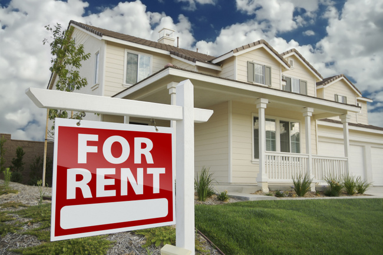

# Week6_Midterm

## Section 1: Aguring for buying a house

Benefits of buying:

Fixed payment for a long period of time. (Property tax changes - but it’s a smaller percentage). Salary / Income increase with inflation, but payments remain the same.
Build equity on the home. The principal payment adds a little more equity every month.
Increase in Home value over time. This is additional growth on all the equity you have on the home.

## Section 2: Arguing against buying a house

Renting house advantages

Fewer (if any) maintenance costs No down payment required (less deposit) No real estate taxes (renters insurance optional) Less stress (who cares, it’s not yours!) Freedom to move or downsize when necessary No risk of home price depreciation Some utility bills may be included “Free” amenities such as pool, gym, security Money can be used for other, more profitable investments Can’t be foreclosed on